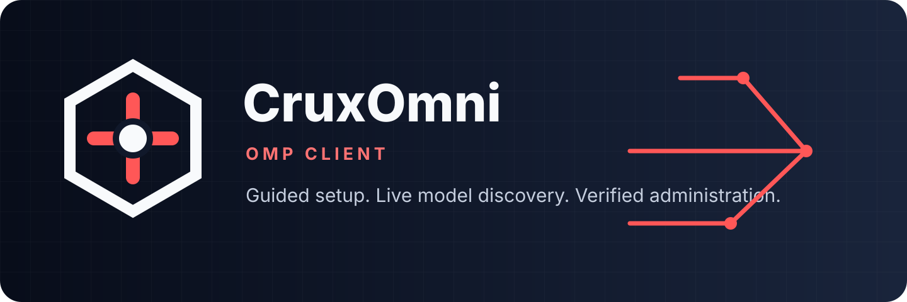

# CruxOmni-OMP-Client

<p align="center">
  <picture>
    <source media="(prefers-color-scheme: dark)" srcset="assets/cruxomni-logo-dark.svg">
    
  </picture>
</p>

<p align="center"><strong>Native setup, live model discovery, and evidence-bound OmniRoute administration for Oh My Pi.</strong></p>

<p align="center"></p>

`@cruxexperts/cruxomni-omp-client` is the public package identity. The internal
provider ID is `omniroute`, matching the upstream service named by model IDs and
OMP native credential records.

A standalone Oh My Pi extension for authenticated OmniRoute model discovery,
native sign-in, offline recovery, source-backed pricing inspection, and
human-authorized OmniRoute administration.

Copyright © 2026 Crux Experts LLC. Licensed under the MIT License; see
[LICENSE](LICENSE).

**Version:** 0.1.0

The original CruxOmni graphics are reserved Crux Experts LLC assets. They are
displayed here under the project-reference/display grant in
[ASSET_LICENSE.md](ASSET_LICENSE.md); the grant does not relicense the artwork.

## Versioning and releases

[`VERSION`](VERSION) is the canonical semantic version and must match
`package.json`. `bun run version:check` enforces that contract,
`bun run version:plan` calculates the next patch-default version from commits
since the latest `vX.Y.Z` tag, and `bun run version:set X.Y.Z` updates both
version owners. Add `Release-Type: minor` or `Release-Type: major` to a
Conventional Commit body when a release must exceed the default patch bump.

Releases are triggered only by an annotated OpenPGP-signed `vX.Y.Z` tag. The
release workflow verifies the exact Crux Experts release-key fingerprint,
rebuilds and tests from the tagged source, verifies checksums, and publishes
the immutable artifacts to the matching GitHub Release. Tags are created
locally so the private signing key is never placed in GitHub Actions.

> **Production status:** this package is not enabled by the parent MyRig
> production configuration. Installing or linking it does not enable a
> production extension, change a selected model, or alter an OmniRoute server.

## What it provides

- Native OMP provider registration even before setup, while offline, or while
  recovering a pending sign-in.
- Exact live model identity from authenticated `GET /v1/models`; a valid empty
  response is authoritative and failed or malformed data is never treated as an
  empty catalog.
- Responses and Chat Completions transport selection from explicit route
  metadata, with specialty-only routes retained for diagnostics rather than
  presented as chat-capable.
- Bounded HTTP, redirect rejection, one bounded retry for safe reads, shutdown
  cancellation, and same-generation stale-row recovery in memory only.
- Separate runtime, metadata, and administration credential bindings.
- A versioned administration registry with typed validators, redacted
  projections, previews, drift checks, and an interactive human confirmation
  gate for every mutation or sensitive read.
- Source-backed pricing inspection that distinguishes `known`, `unknown`,
  `conditional`, and `stale`; compatibility zeroes in OMP numeric fields never
  mean free service.

The package does not bundle another OMP runtime, write management credentials
into its profile, install local services or hooks, or provide an arbitrary HTTP
or arbitrary-path administration tool.

## Quick start

Install the package into the OMP environment, link it for the active profile,
restart OMP, and open the guided wizard:

```bash
bun add @cruxexperts/cruxomni-omp-client
omp plugin link "$PWD/node_modules/@cruxexperts/cruxomni-omp-client"
```

```text
/cruxomni setup
```

The wizard saves sections independently. Connection setup asks for the gateway
URL and runtime key, uses OMP's masked native credential store, validates the
binding, and refreshes live models before reporting success. Metadata,
administration, and pricing are optional sections. Cancelling a section leaves
previously saved sections unchanged.


This image is a documentation rendering of the sanitized, fixture-only OMP
18.2.6 terminal capture in
[`assets/setup-wizard-transcript.txt`](assets/setup-wizard-transcript.txt). It
contains no live profile, endpoint, model, or credential data.

For an extracted checkout, link the checkout root instead of a
`node_modules` path:

```bash
omp plugin link /path/to/CruxOmni-OMP-Client
```

Do not copy an OMP profile or `models.db` between machines. Existing native
runtime credentials remain owned by OMP; the extension does not migrate secret
values into its JSON configuration.

## Compatibility and provenance

Compatibility is defined at the OMP extension boundary. The supported host
range is `>=18.2.3 <19`; package installation may resolve any compatible OMP
18.x SDK package while the development lock retains exact versions for
reproducible tests. The compatibility matrix exercises the minimum supported
host and the latest stable host rather than requiring one release forever.

The tested matrix is Oh My Pi `v18.2.3` and `v18.2.6`; 18.2.6 is the current
latest stable and corresponds to commit
`78b753124d11f8dd3ae73e2524125890ff7c977e`. OMP 18.2.3 is the security floor
because it introduced masked provider-login prompts and prevented secret prompt
answers from being recovered through prompt history. Runtime gateway
compatibility requires authenticated `/v1/models` plus the advertised OpenAI-compatible
transport selected for each live model. Administration compatibility is
checked per closed operation descriptor; unsupported or changed operations
fail individually rather than invalidating provider discovery.

[`provenance/upstreams.json`](provenance/upstreams.json) records the immutable
OMP host identity and the OmniRoute source snapshot used to generate the
versioned administration corpus. The OmniRoute record is generation
provenance, not a JavaScript dependency or a requirement to run that exact
server build. Re-checking upstream selectors detects host or corpus drift; only
an OMP host change affects the runtime compatibility claim directly.

The package's complete, versioned control-plane descriptor corpus is the
[operation inventory](contracts/operations.json), validated by
[`operations.schema.json`](contracts/operations.schema.json) and attributed to
[`route-sources.json`](provenance/route-sources.json). Each descriptor records
its literal method and path template, validated path/query/body and response
schemas, media types, auth domain and scopes, secret fields, side-effect/risk
class, pagination and streaming mode, confirmation and retry rules, source
file/hash, and invokable or explicitly non-invokable coverage status. The
inventory covers provider/model/alias/visibility controls, combo DAGs,
routing/fallbacks, keys/scopes/quotas/budgets, pricing/resilience/rate
controls, usage/telemetry, context/cache/memory, MCP/A2A, services and client
integrations, skills/plugins, tunnels/webhooks, backups/import/export/restore,
sync, authentication workflows, and lifecycle operations.

Administration eligibility is a separate release contract:
[`release-eligibility.json`](contracts/release-eligibility.json). An operation
is available only when its exact pinned source hashes and behavior evidence are
present there. Every other descriptor remains visible for audit with an
unavailable reason and cannot be read, planned, applied, or dispatched. The
current verified baseline is intentionally small; inventory size is not a
claim of functional coverage.

## Install and link

The extension requires an OMP host and SDK packages in the declared
`>=18.2.3 <19` range plus Bun `>=1.4.2`. For a released package:

```bash
bun add @cruxexperts/cruxomni-omp-client
omp plugin link "$PWD/node_modules/@cruxexperts/cruxomni-omp-client"
```

For an extracted release archive or a local checkout, link the package root
instead:

```bash
omp plugin link /path/to/CruxOmni-OMP-Client
```

Linking is local to the OMP profile. It does not modify the parent repository's
production extension list. Remove the link with the host's normal plugin
uninstall/disable command when finished. Do not copy an OMP `models.db` or a
profile from another machine.

## Package integrity and conformance acceptance

`package.json` pins the Bun toolchain with `packageManager`, declares the OMP
compatibility range, and commits the generated Bun text lockfile. The lock is
the reviewed source of exact development and transitive package identities and
integrities; CI uses
`bun install --frozen-lockfile --ignore-scripts`. After dependency review, run:

```bash
bun install --frozen-lockfile --ignore-scripts
bun run verify:package
```

`verify:package` fails closed without that lock and emits a complete
transitive CycloneDX SBOM, lockfile SHA-256, per-component integrity hashes,
and dependency relationships. A direct-dependency list is not an acceptable
SBOM.

Conformance targets the OMP host lifecycle and the functional gateway boundary:
provider registration before model selection, native sign-in, authenticated
model discovery, transport selection, inference, tool registration, and clean
disable/uninstall. `bun run smoke` retains the release-asset integrity lane.
`OMP_BINARY_PATH="$(command -v omp)" bun run smoke:installed` drives the same
behavior through the installed CLI after verifying its package identity,
reported version, and supported range. Both use disposable profiles and
loopback fixtures. The package never installs or builds OmniRoute's web
application to prove extension compatibility.

## Native sign-in and discovery

Native OMP sign-in stores the key; the extension stores only the non-secret
endpoint marker. In the current process, run `/cruxomni refresh` to activate
the new binding immediately. If the process exits with a pending marker, the
next process remains auth-only and requires a fresh native sign-in; it never
tests a stored key against either the old or pending endpoint.

1. Start OMP with the linked package and open its native provider sign-in
   selector.
2. Choose `omniroute`. Enter an OmniRoute root URL or `/v1` URL and then enter
   the API key in the masked prompt. Userinfo, query strings, fragments,
   redirects, and non-HTTP(S) URLs are rejected. HTTPS is the default; loopback
   HTTP is allowed for local fixtures. Remote HTTP requires an explicit
   interactive insecure-transport warning and saved choice.
3. The key is returned to OMP's native AuthStorage. The extension stages only a
   non-secret pending endpoint marker, so a cancelled sign-in leaves the active
   configuration unchanged.
4. To use the binding immediately in the current process, run:

   ```text
   /cruxomni refresh
   ```

   The extension resolves the just-persisted native key, compares it with the
   in-memory candidate, then commits the endpoint and discovers live models. A
   mismatch performs no authenticated request. A later OMP start does not
   recover a pending marker automatically; sign in again to create a new
   in-memory candidate, then run `/cruxomni refresh`.
5. Inspect state with `/cruxomni` (or `/cruxomni status`). Use
   `/cruxomni refresh` at any time as the explicit recovery probe.

The profile stores non-secret endpoint state under the OMP agent directory in
`omniroute/config.json`. The directory is private (`0700`) and the file is
private and atomic (`0600`). The file contains endpoint generations and flags,
not runtime, metadata, or administration keys.

## Environment mode

For automation or an intentionally read-only binding, provide the endpoint and
runtime key together:

```bash
export OMP_OMNIROUTE_BASE_URL="https://gateway.example"
export OMP_OMNIROUTE_API_KEY="$RUNTIME_KEY"
```

Both variables are required; a partial pair is rejected before network I/O.
Environment mode is read-only from the setup wizard and takes precedence over
the profile binding. Both variables are required; an incomplete pair leaves
the extension offline and sends no request. Never put a key in this README, a
plugin config file, shell history, or a transcript.

Optional, explicitly separate bindings are:

- `OMP_OMNIROUTE_METADATA_API_KEY` for the same deployment's optional metadata
  catalog. It is never inferred from the runtime key.
- `OMP_OMNIROUTE_PRICING_FILE` for a local, atomic seller-pricing projection.
- `OMP_OMNIROUTE_ADMIN_API_KEY` or `OMP_OMNIROUTE_ADMIN_COOKIE` for a
  session-only administration credential. Durable secrets should come from a
  secret manager or environment reference, not plugin JSON.

## Offline and recovery behavior

The health state separates setup, authentication, discovery, metadata, and
administration. A missing setup is quiet. Discovery has a ten-second total
budget, an eight MiB response limit, and JSON depth limit 24. Only safe reads
may retry once for transient responses. Each extension-owned inference
invocation rejects redirects and permits one outbound POST. Tested OMP 18.2.x
hosts do not expose a logical request identity that lets an extension suppress a later outer
agent-loop re-entry after an uncertain outcome, so this package does not claim
session-wide no-replay.

- During a transient outage, same-endpoint and same-credential-generation
  rows may remain available in memory and are labeled stale.
- The plugin maintains no persistent model cache or polling loop. Tested OMP
  18.2.x hosts maintain their own provider-name SQLite selector cache for dynamic models
  and offers no extension cache-disable hook. Cached rows cannot infer through
  this package after the binding changes, but they may remain visible in the
  host selector until OMP refreshes its cache.
- Run `/cruxomni refresh` to probe recovery. A valid empty live list removes
  prior identities for that cycle.
- If a process died after native credential persistence, the pending marker
  remains fail-closed. Sign in again and run `/cruxomni refresh`. The extension
  never falls back to an old endpoint with a potentially new key.
- Changing endpoint or credential generation cancels in-flight discovery,
  unregisters the previous source-owned model set, and prevents a new key from
  being sent to the old endpoint.

## Administration example

Administration is opt-in and independent from ordinary model discovery. Run
`/cruxomni-admin enable` to persist only the
non-secret `adminEnabled` flag for
the already active exact endpoint, then bind a management credential. The
following example uses an environment reference; the value is never copied to
plugin JSON:

```bash
export OMP_OMNIROUTE_ADMIN_API_KEY="$ADMIN_KEY"
```

In an interactive OMP session:

```text
/cruxomni-admin providers
/cruxomni-admin apply <plan-id>
/cruxomni-admin disable
/cruxomni-admin logout
```

`/cruxomni-admin` searches the closed operation registry, validates typed JSON
input, creates a short-lived plan, and displays the exact target plus a
redacted change. `apply` requires an interactive human UI, typing `APPLY`, and a
second confirmation of side effects and irreversible consequences. Denial,
cancellation, headless execution, expiry, endpoint/credential changes, or
mutable-target drift sends zero mutation requests. A lost write response is
reported unknown and reconciled once; it is never blindly replayed.
`disable` persists false and clears plans, credentials, and bindings without
changing runtime login state. `logout` also blocks automatic environment
credential rebinding until a human explicitly enables administration again.
An operator-required result remains terminal and reports the separate supported
human action; it is never labeled applied.

Agents may use only the registered `omniroute_admin_read` and
`omniroute_admin_plan` tools. They cannot apply a mutation, submit secret-bearing
inputs, use arbitrary paths, or receive recursive raw responses. The read tool
exposes only ordinary safe reads. Sensitive reads use the human plan/apply flow,
and unknown fields are withheld. Exports and one-time secrets require an
explicit protected destination created exclusively with private permissions;
raw output never enters model-visible output or notifications.

An unavailable operation is not a temporary permission prompt. It means the
release eligibility contract lacks adequate pinned-source and behavior
evidence, or that the evidence no longer matches the descriptor. The UI and
agent tools keep that operation visible with its reason, but all paths fail
closed before a request. Adding an operation requires source-backed evidence,
typed request/response behavior, and focused fixtures; do not mark a route
verified because its generic schema happens to validate.

## Pricing inspection

Pricing is an inspection aid, not an invoice and never creates model identity.
Point `OMP_OMNIROUTE_PRICING_FILE` (or the non-secret profile `pricingFile`) at
an atomic JSON projection accepted by the package pricing validator. The
projection must carry source URLs, expiry and snapshot hashes, exact seller and
native-ID mappings, billing products, meters, units, currency, conditions, and
its canonical content digest. Do not substitute a database, a remote path, or
an unreviewed estimate.

Use the plugin commands after a live refresh:

```text
/cruxomni pricing
/cruxomni pricing openai/gpt-5-mini
/cruxomni-pricing openai/gpt-5-mini
```

The first form reports coverage and source/file state. The model form reports
exact seller/product/native-ID joins, per-meter state, conditions, source URLs,
and compatibility numeric values. States are `known`, `unknown`,
`conditional`, or `stale`; a published zero is distinct from unknown. OMP's
numeric dynamic-model contract cannot represent unknown costs, so unknown or
conditional fields appear as numeric zero with an explicit warning. Combos do
not receive guessed prices. A corrupt or unavailable current file may leave a
prior in-process view inspectable, but it is never relabeled current.

## Security and contributions

Read [SECURITY.md](SECURITY.md) for the threat model and private reporting
procedure. Read [CONTRIBUTING.md](CONTRIBUTING.md) before changing source,
contracts, provenance, or docs.

See the focused public guides for [installation and setup](docs/installation.md)
and [troubleshooting](docs/troubleshooting.md).

## Third-party notices

The extension uses the Oh My Pi SDK packages as declared in `package.json` and
expects Bun and TypeScript for its development/runtime toolchain. It does not
bundle an OMP runtime or copy upstream server source. Review the license and
notices shipped by each dependency's own distribution, especially
[Oh My Pi](https://github.com/can1357/oh-my-pi), before redistributing a
combined artifact. OmniRoute is an external server dependency; this extension
does not include or relicense its source. This repository's original source and
documentation are Copyright (c) 2026 Crux Experts LLC and distributed under
[MIT](LICENSE).
