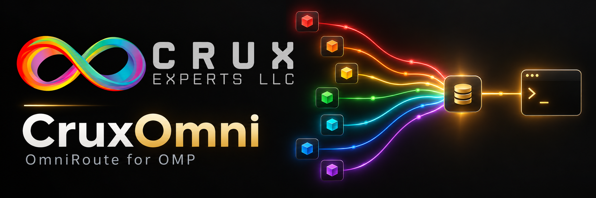
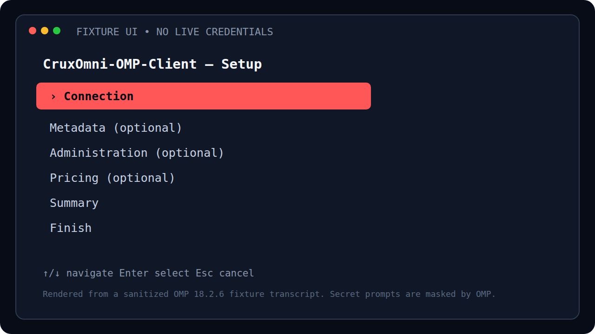

<p align="center">
  
</p>

<h1 align="center">CruxOmni for OMP</h1>

<p align="center">
  Connect Oh My Pi to OmniRoute without hand-editing config files or juggling API keys.
</p>

<p align="center">
  <a href="https://github.com/CruxExperts/CruxOmni-OMP-Client/releases/latest">Download</a>
  · <a href="docs/installation.md">Setup guide</a>
  · <a href="docs/troubleshooting.md">Troubleshooting</a>
</p>

## Why use it?

OmniRoute is useful. Config archaeology is not. CruxOmni makes OmniRoute feel
like it belongs in OMP:

- Run one command and follow the setup wizard.
- Discover the models your OmniRoute instance actually offers. No static list
  to babysit.
- Keep runtime keys in OMP's masked credential storage, not a JSON file.
- See the difference between known, unknown, conditional, and stale prices.
- Preview and confirm sensitive admin actions before anything happens.

That's the whole pitch: less setup, fewer surprises, more time using the models.

## Get started

```bash
git clone https://github.com/CruxExperts/CruxOmni-OMP-Client.git
cd CruxOmni-OMP-Client
bun install --frozen-lockfile --ignore-scripts
omp plugin link "$PWD"
```

Restart OMP, then open the wizard:

```text
/cruxomni setup
```

Connection setup comes first. Pricing, metadata, and administration are
optional, so the wizard can stay as simple as you need it to be.

<p align="center">
  
</p>

## Everyday commands

| Command | What it does |
| --- | --- |
| `/cruxomni setup` | Opens the guided setup wizard |
| `/cruxomni` | Shows connection and configuration status |
| `/cruxomni refresh` | Refreshes the model catalog |
| `/cruxomni-pricing` | Shows pricing information |
| `/cruxomni-admin` | Opens guarded administration tools |

## Prefer environment variables?

They are still available for automation and read-only environments:

```bash
export OMP_OMNIROUTE_BASE_URL="https://gateway.example"
export OMP_OMNIROUTE_API_KEY="$RUNTIME_KEY"
```

Set both values together. For normal interactive use, the wizard is easier.

## Requirements

- Oh My Pi `18.2.3` through `18.x`
- Bun `1.4.2` or newer
- An OmniRoute endpoint and runtime API key

Every change is tested against OMP `18.2.3` and `18.2.6`.

## More

- [Installation and guided setup](docs/installation.md)
- [Troubleshooting and recovery](docs/troubleshooting.md)
- [Security policy](SECURITY.md)
- [Contributing](CONTRIBUTING.md)
- [Releases and changes](CHANGELOG.md)

---

<p align="center">
  © 2026 <a href="https://www.cruxexperts.com/">Crux Experts LLC</a> · Released under the <a href="LICENSE">MIT License</a>
</p>
